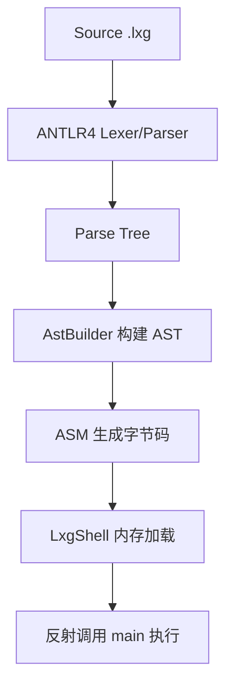

<h1 align="center">my language</h1>
<p align="center">
  <strong>专为初学者设计的编译原理学习项目</strong>
</p>
<p align="center">
    <a target="_blank" href='https://www.apache.org/licenses/LICENSE-2.0.html'>
        
    </a>
    <a target="_blank" href="https://github.com/xiangganLuo/my-language">
        
    </a>
</p>


---

## 📚 简介

my language 是一个专为初学者设计的迷你编程语言项目，通过实现一个完整的编译器来学习编译原理。项目采用模块化设计，从词法分析到字节码生成，每个环节都清晰可见并配备详细的代码注释，是学习编译原理的绝佳实践项目。

---

## ⚡ 5 分钟快速上手

- 准备环境：安装 JDK 1.8 与 Maven（macOS 可 `brew install maven`）
- 构建：
```bash
mvn -q -DskipTests clean package
```
- 跑第一个程序：
```bash
java -jar target/my-language-0.1.0-SNAPSHOT.jar examples/hello.lxg
```
- 透视编译各阶段（依次开启调试开关）：
```bash
# 词法 Token（字符→Token）
java -jar target/my-language-0.1.0-SNAPSHOT.jar examples/hello.lxg --dump-tokens
# 解析树（Token→语法结构）
java -jar target/my-language-0.1.0-SNAPSHOT.jar examples/hello.lxg --dump-parse-tree | cat
# AST（解析树→抽象语法树）
java -jar target/my-language-0.1.0-SNAPSHOT.jar examples/hello.lxg --dump-ast
```
- 导出并反汇编字节码：
```bash
java -jar target/my-language-0.1.0-SNAPSHOT.jar examples/hello.lxg --emit-class=out/Program.class
javap -v out/Program.class | cat
```
- 看一个语义错误示例（含源码位置的诊断）：
```bash
java -jar target/my-language-0.1.0-SNAPSHOT.jar examples/error_undeclared.lxg
```

---

## 🏗️ 模块结构

```
my-language/
├── src/main/antlr4/com/lxg/antlr/  # ANTLR4 语法文件
│   └── Lxg.g4                      # 词法/语法规则定义
├── src/main/java/com/lxg/
│   ├── ast/
│   │   ├── node/                   # AST 节点基础接口与类型
│   │   │   ├── Node.java
│   │   │   ├── Statement.java
│   │   │   ├── Expression.java
│   │   │   ├── ValueType.java
│   │   │   └── SourcePos.java
│   │   ├── program/                # 程序根节点
│   │   │   └── CompilationUnit.java
│   │   ├── expr/                   # 表达式节点
│   │   │   ├── IntLiteral.java
│   │   │   ├── StringLiteral.java
│   │   │   ├── BoolLiteral.java
│   │   │   ├── VarRef.java
│   │   │   ├── UnaryExpr.java
│   │   │   ├── BinaryExpr.java
│   │   │   ├── UnaryOp.java
│   │   │   └── BinaryOp.java
│   │   └── stmt/                   # 语句节点
│   │       ├── LetStmt.java
│   │       ├── AssignStmt.java
│   │       ├── PrintStmt.java
│   │       ├── BlockStmt.java
│   │       └── IfStmt.java
│   ├── frontend/                   # 前端：Parse Tree → AST（填充 SourcePos）
│   │   └── AstBuilder.java
│   ├── sema/                       # 语义分析（符号表/类型/作用域/诊断）
│   │   ├── SymbolTable.java
│   │   ├── Local.java
│   │   ├── Diagnostics.java
│   │   └── TypeChecker.java
│   ├── codegen/                    # 代码生成：AST → JVM 字节码
│   │   ├── ClassGenerator.java
│   │   └── CodeEmitter.java
│   ├── runtime/                    # 运行时：加载与执行
│   │   ├── LxgShell.java
│   │   └── InMemoryClassLoader.java
│   └── tools/                      # CLI 工具与入口
│       ├── Main.java
│       └── AstPrinter.java
├── src/test/java/com/lxg/          # 测试模块
│   ├── LxgEndToEndTest.java
│   ├── LexerSmokeTest.java
│   ├── AstPrinterTest.java
│   └── SemanticErrorTest.java
├── examples/                       # 示例程序
│   ├── hello.lxg
│   ├── arithmetic.lxg
│   ├── conditions.lxg
│   ├── error_undeclared.lxg        # 未声明变量
│   └── error_type_mismatch.lxg     # 类型不匹配
├── docs/
│   └── Quick Start.md            # 学习路径（独立文档）
└── pom.xml                         # Maven 配置
```

| 模块名                    | 说明                                   |
|--------------------------|----------------------------------------|
| antlr4                   | ANTLR4 语法定义，生成词法/语法分析器     |
| ast/node                 | AST 基础接口与类型（含 SourcePos）        |
| ast/expr                 | 表达式节点（字面量/变量/运算）           |
| ast/stmt                 | 语句节点（let/assign/print/if/block）    |
| ast/program              | 程序根节点                               |
| frontend                 | 解析树到 AST 的转换并填充位置信息         |
| sema                     | 符号表、最小类型检查、诊断信息输出        |
| codegen                  | 生成 JVM 字节码                           |
| runtime                  | 内存加载与反射执行                        |
| tools                    | CLI 与调试开关入口、AST 打印              |

---

## 📦 环境与构建

```bash
# 构建（跳过测试）
mvn -q -DskipTests clean package

# 运行示例
java -jar target/my-language-0.1.0-SNAPSHOT.jar examples/hello.lxg

# 生成 .class 并用 javap 调试
java -jar target/my-language-0.1.0-SNAPSHOT.jar examples/hello.lxg --emit-class=out/Program.class
javap -v out/Program.class | cat
```

---

## 📝 语言特性

- 语句：`let`、赋值、`print`、`if/else`、`{}` 语句块
- 表达式：`+ - * /`、`== != < > <= >=`、一元 `+ - !`
- 类型：`int`、`string`、`boolean`

---

## 🔧 核心流程（源码 → 执行）



---

## 🔍 调试开关使用说明

- --dump-tokens：打印词法 Token（类型与文本），用于观察“字符 → Token”的阶段。
```bash
java -jar target/my-language-0.1.0-SNAPSHOT.jar examples/hello.lxg --dump-tokens
```

- --dump-parse-tree：打印解析树（Parse Tree），用于观察“Token → 语法结构”的阶段。
```bash
java -jar target/my-language-0.1.0-SNAPSHOT.jar examples/hello.lxg --dump-parse-tree | cat
```

- --dump-ast：打印抽象语法树（AST），用于观察“解析树 → AST”的抽象化结果。
```bash
java -jar target/my-language-0.1.0-SNAPSHOT.jar examples/hello.lxg --dump-ast
```

- --emit-class=<path>：将生成的 .class 写入磁盘，便于使用 `javap -v` 反汇编查看字节码。
```bash
java -jar target/my-language-0.1.0-SNAPSHOT.jar examples/hello.lxg --emit-class=out/Program.class
javap -v out/Program.class | cat
```

- 组合示例：同时打印 AST 并导出字节码
```bash
java -jar target/my-language-0.1.0-SNAPSHOT.jar examples/hello.lxg --dump-ast --emit-class=out/Program.class
```

> 建议先从 `--dump-tokens` 开始逐层观察，再配合 `--emit-class` + `javap -v` 对照指令级别的变化。

---

## 📄 许可证

本项目采用 [Apache License 2.0](LICENSE) 许可证。

---

<p align="center">
  <strong>让编译原理学习更简单、更直观！</strong>
</p> 