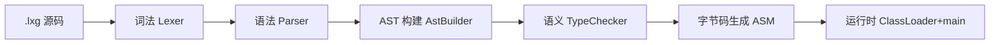
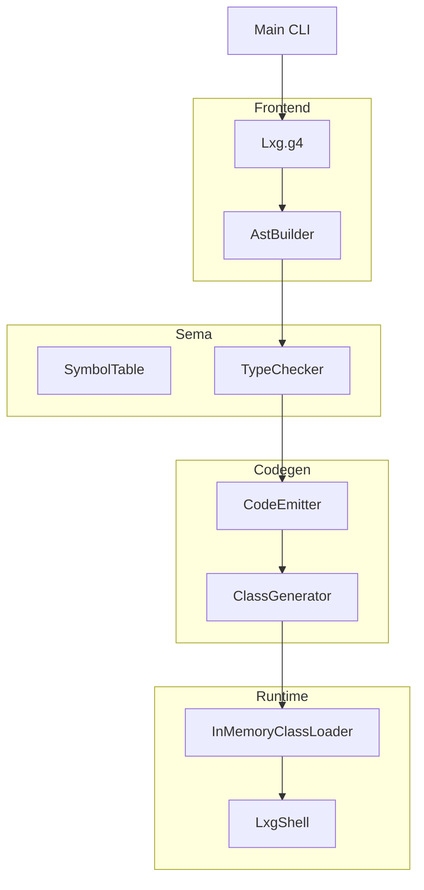

# 第1章 为什么要自己做一门语言

# 一、前言

沉淀、分享、成长，让自己和他人都能有所收获！😄

上手编译器常见的阻碍，不是“写不出代码”，而是“不知道从哪问起”。为了降低门槛，本章用可运行的极简语言 LXG，带你从零搭起“源码 →
字节码 → 执行”的主线，并在每一步给出能跑的命令、可视的产物与对照参照物（AST 文本、`javap -v` 反汇编）。

本章从动机出发，回答“为什么要自己做一门语言？”并给出最小可运行目标和学习边界，帮助你有节奏地打开后续章节。

# 二、目标

- 认识最小语言范围（语句/表达式/类型）与学习边界
- 建立“分层心智模型”：词法 → 语法/AST → 语义 → 代码生成 → 运行时
- 跑通第一个程序，并能逐层 dump 与字节码对照

示例目标（运行后在控制台看到 hello）：

```bash
mvn -q -DskipTests clean package
java -jar target/my-language-0.1.0-SNAPSHOT.jar examples/hello.lxg
```

# 三、设计

1) 最小语言范围（刚好够跑通主线）

- 语句：`let`、赋值、`print`、`if/else`、`{}`
- 表达式：一元 `+ - !`；二元 `+ - * /`、`== != < > <= >=`
- 类型：`int`、`string`、`boolean`

2) 分层与模块映射

- 词法/语法（ANTLR）：`src/main/antlr4/com/lxg/antlr/Lxg.g4`
- 前端构建（Parse Tree → AST）：`com.lxg.frontend.AstBuilder`
- AST 结构根目录：`com.lxg.ast`
- 语义分析：`com.lxg.sema.SymbolTable`、`com.lxg.sema.TypeChecker`、`com.lxg.sema.Diagnostics`
- 代码生成（ASM）：`com.lxg.codegen.CodeEmitter`、`com.lxg.codegen.ClassGenerator`
- 运行时：`com.lxg.runtime.InMemoryClassLoader`、`com.lxg.runtime.LxgShell`
- CLI：`com.lxg.tools.Main`

3) 核心流程图（从源码到执行）



4) 架构视图（模块交互）



5) 关键设计取舍

- “平坦作用域”优先：先不引入作用域栈，保证直观易懂
- “左结合 + 分层优先级”的表达式文法，利于构建与生成
- AST 携带 `SourcePos`，诊断信息带行列，便于定位

# 四、实现

0) 术语说明（阅读工程结构前先了解）

- 包（package）：Java 源码的命名空间层级，如 `com.lxg.codegen`
- 模块（module）：按职责划分的功能子域，如 `frontend`、`sema`、`codegen`
- 词法/语法（lexer/parser）：把字符切成 Token / 把 Token 组装成结构
- AST：抽象语法树，仅保留与语义/生成相关的节点
- 符号表（symbol table）：记录变量名与类型、槽位等绑定信息
- 字节码（bytecode）：JVM 可执行的中间指令序列（.class）

1) 工程结构（参照你提供的目录格式，逐级列出）

```
language-lxg
└── src
    ├── main
    │   ├── antlr4
    │   │   └── com
    │   │       └── lxg
    │   │           └── antlr
    │   │               └── Lxg.g4
    │   └── java
    │       └── com
    │           └── lxg
    │               ├── ast
    │               │   ├── node
    │               │   │   ├── Node.java
    │               │   │   ├── Statement.java
    │               │   │   ├── Expression.java
    │               │   │   ├── ValueType.java
    │               │   │   └── SourcePos.java
    │               │   ├── expr
    │               │   │   ├── IntLiteral.java
    │               │   │   ├── StringLiteral.java
    │               │   │   ├── BoolLiteral.java
    │               │   │   ├── VarRef.java
    │               │   │   ├── UnaryOp.java
    │               │   │   ├── UnaryExpr.java
    │               │   │   ├── BinaryOp.java
    │               │   │   └── BinaryExpr.java
    │               │   ├── stmt
    │               │   │   ├── LetStmt.java
    │               │   │   ├── AssignStmt.java
    │               │   │   ├── PrintStmt.java
    │               │   │   ├── BlockStmt.java
    │               │   │   └── IfStmt.java
    │               │   └── program
    │               │       └── CompilationUnit.java
    │               ├── frontend
    │               │   └── AstBuilder.java
    │               ├── sema
    │               │   ├── SymbolTable.java
    │               │   ├── Local.java
    │               │   ├── Diagnostics.java
    │               │   └── TypeChecker.java
    │               ├── codegen
    │               │   ├── ClassGenerator.java
    │               │   └── CodeEmitter.java
    │               ├── runtime
    │               │   ├── InMemoryClassLoader.java
    │               │   └── LxgShell.java
    │               └── tools
    │                   ├── Main.java
    │                   └── AstPrinter.java
    └── test
        └── java
            └── com
                └── lxg
                    ├── LexerSmokeTest.java
                    ├── AstPrinterTest.java
                    ├── SemanticErrorTest.java
                    └── LxgEndToEndTest.java
```

2) 先跑起来（逐层可视）

```bash
# 词法 Token（字符→Token）
java -jar target/my-language-0.1.0-SNAPSHOT.jar examples/hello.lxg --dump-tokens
# 解析树（Token→语法结构）
java -jar target/my-language-0.1.0-SNAPSHOT.jar examples/hello.lxg --dump-parse-tree | cat
# AST（解析树→抽象语法树）
java -jar target/my-language-0.1.0-SNAPSHOT.jar examples/hello.lxg --dump-ast
# 导出字节码并反汇编
java -jar target/my-language-0.1.0-SNAPSHOT.jar examples/hello.lxg --emit-class=out/Program.class
javap -v out/Program.class | sed -n '1,200p'
```

3) 核心代码摘录（只看主干）

文法：语句与表达式分层（节选）

```5:13:src/main/antlr4/com/lxg/antlr/Lxg.g4
stmt
    : 'print' expr ';'
    | 'let' ID '=' expr ';'
    | ID '=' expr ';'
    | 'if' '(' expr ')' block ('else' block)?
    | block
    ;
```

主流程：解析 → AST → 语义 → 生成 → 运行

```77:121:src/main/java/com/lxg/tools/Main.java
public static void runSource(String source, String emitClassPath, boolean dumpTokens, boolean dumpParseTree, boolean dumpAst) {
    try {
        // 1) Lexer/Parser
        LxgLexer lexer = new LxgLexer(CharStreams.fromString(source));
        CommonTokenStream tokens = new CommonTokenStream(lexer);
        if (dumpTokens) {
            tokens.fill();
            for (Token t : tokens.getTokens()) {
                System.out.println(t.getText() + " -> " + LxgLexer.VOCABULARY.getDisplayName(t.getType()));
            }
        }
        LxgParser parser = new LxgParser(tokens);
        LxgParser.ProgContext prog = parser.prog();
        if (dumpParseTree) {
            System.out.println(prog.toStringTree(parser));
        }

        // 2) AST
        AstBuilder builder = new AstBuilder();
        CompilationUnit unit = builder.build(prog);
        if (dumpAst) {
            System.out.println(AstPrinter.print(unit));
        }

        // 3) Semantic check
        Diagnostics diags = new TypeChecker().check(unit);
        if (diags.hasErrors()) {
            diags.printAll(System.err);
            return; // 中止
        }

        // 4) Codegen
        ClassGenerator gen = new ClassGenerator();
        byte[] cls = gen.generate(unit);

        // 5) 可选：写出 .class
        if (emitClassPath != null && !emitClassPath.isEmpty()) {
            Path out = Paths.get(emitClassPath);
            Files.createDirectories(out.getParent() == null ? Paths.get(".") : out.getParent());
            Files.write(out, cls);
            System.out.println("Emitted class to: " + out.toAbsolutePath());
        }

        // 6) 在内存中加载并执行 main
        new LxgShell().run(cls);
    } catch (Exception e) {
        e.printStackTrace(System.err);
        throw new RuntimeException("Failed to run source", e);
    }
}
```

打印发射：根据静态类型选择 `println` 重载

```74:86:src/main/java/com/lxg/codegen/CodeEmitter.java
private void emitPrint(PrintStmt ps) {
    mv.visitFieldInsn(GETSTATIC, "java/lang/System", "out", "Ljava/io/PrintStream;");
    ValueType type = emitExpression(ps.expression);
    if (type == ValueType.INT) {
        mv.visitMethodInsn(INVOKEVIRTUAL, "java/io/PrintStream", "println", "(I)V", false);
    } else if (type == ValueType.STRING) {
        mv.visitMethodInsn(INVOKEVIRTUAL, "java/io/PrintStream", "println", "(Ljava/lang/String;)V", false);
    } else if (type == ValueType.BOOLEAN) {
        mv.visitMethodInsn(INVOKEVIRTUAL, "java/io/PrintStream", "println", "(Z)V", false);
    } else {
        throw new IllegalStateException("Unsupported type in print: " + type);
    }
}
```

# 五、测试

1) 分层测试

- 词法冒烟：`LexerSmokeTest`（Token 关键类型）
- AST 打印：`AstPrinterTest`（关键结构文本）
- 语义错误：`SemanticErrorTest`（未声明/类型不匹配）
- 端到端：`LxgEndToEndTest`（打印、四则、分支）

2) 运行命令

```bash
mvn -q test
mvn -q -Dtest=LexerSmokeTest test
mvn -q -Dtest=LxgEndToEndTest test
```

3) 快速排错

- 无法解析：先看 `--dump-tokens` 是否正常；再看 `--dump-parse-tree`
- AST 不对：核对 `AstBuilder` 是否按左结合折叠，并携带 `SourcePos`
- 语义错误无位置：确认 `SourcePos` 传递
- 运行期异常：核对 `Label` 跳转与 `println` 重载签名

# 六、总结

- 本章确立了“最小语言 + 分层主线”的学习方式。你已经能跑通第一个程序，并逐层观察产物（tokens/parse-tree/ast/bytecode）。
- 牢记套路：用调试开关自下而上验证，用 `javap -v` 对照生成是否符合预期。
- 下一步：进入第 2 章，按“命令行 → 解析 → AST → 语义 → 生成 →
  运行”的顺序加深理解；随后在语法与生成两端同时做一次小扩展（例如 `%`）。 