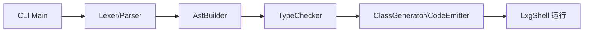
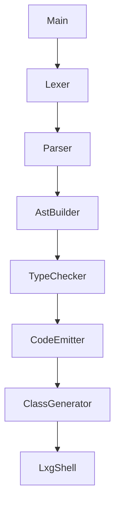

# 第2章 5分钟跑通我的第一段程序

# 一、前言

本章通过可复制命令，帮你在 5 分钟内跑通“源码→执行”的完整路径，并建立逐层调试的习惯。

# 二、目标

- 完成构建并运行示例程序
- 会使用三层调试开关与字节码反汇编
- 能描述从 CLI 到执行的关键调用链

# 三、设计

术语说明：

- CLI：命令行入口，负责参数解析与编译流水线调度
- dump：打印中间产物，便于定位问题

核心流程图：



架构交互图：



# 四、实现

目录树（最小关注集）：

```text
language-lxg
└── src
    └── main
        ├── antlr4
        │   └── com
        │       └── lxg
        │           └── antlr
        │               └── Lxg.g4
        └── java
            └── com
                └── lxg
                    ├── tools
                    │   └── Main.java
                    ├── frontend
                    │   └── AstBuilder.java
                    ├── sema
                    │   ├── TypeChecker.java
                    │   ├── SymbolTable.java
                    │   └── Diagnostics.java
                    ├── codegen
                    │   ├── ClassGenerator.java
                    │   └── CodeEmitter.java
                    └── runtime
                        ├── InMemoryClassLoader.java
                        └── LxgShell.java
```

命令（一步步）：

```bash
mvn -q -DskipTests clean package
java -jar target/my-language-0.1.0-SNAPSHOT.jar examples/arithmetic.lxg
java -jar target/my-language-0.1.0-SNAPSHOT.jar examples/arithmetic.lxg --dump-tokens
java -jar target/my-language-0.1.0-SNAPSHOT.jar examples/arithmetic.lxg --dump-parse-tree | cat
java -jar target/my-language-0.1.0-SNAPSHOT.jar examples/arithmetic.lxg --dump-ast
java -jar target/my-language-0.1.0-SNAPSHOT.jar examples/arithmetic.lxg --emit-class=out/Program.class
javap -v out/Program.class | sed -n '1,200p'
```

代码（节选）：Main 的入口使用说明

```34:43:src/main/java/com/lxg/tools/Main.java
public static void main(String[] args) throws Exception {
    if (args.length == 0) {
        System.out.println("Usage: java -jar my-language.jar <source.lxg> [--emit-class=out/Program.class] [--dump-tokens] [--dump-parse-tree] [--dump-ast]");
        System.out.println("Example source:\n  let x = 1 + 2;\n  if (x > 2) { print x; } else { print 0; }\n  print 42;");
        return;
    }
    // 解析参数...
}
```

代码（节选）：runSource 的开头（流水线起点）

```77:89:src/main/java/com/lxg/tools/Main.java
public static void runSource(String source, String emitClassPath, boolean dumpTokens, boolean dumpParseTree, boolean dumpAst) {
    try {
        // 1) Lexer/Parser
        LxgLexer lexer = new LxgLexer(CharStreams.fromString(source));
        CommonTokenStream tokens = new CommonTokenStream(lexer);
        if (dumpTokens) {
            tokens.fill();
            for (Token t : tokens.getTokens()) {
                System.out.println(t.getText() + " -> " + LxgLexer.VOCABULARY.getDisplayName(t.getType()));
            }
        }
```

# 五、测试

- 端到端：`LxgEndToEndTest`（输出是否与预期一致）
- 快速运行：`mvn -q -Dtest=LxgEndToEndTest test`
- 常见排错：若构建失败，检查是否已安装 Maven；若运行失败，先使用 `--dump-*` 逐层定位

# 六、总结

- 从 CLI 到运行的完整链路已跑通，掌握三层 dump 与 `javap -v`
- 后续章节将对各层（词法、语法/AST、语义、生成、运行时）分别深入 