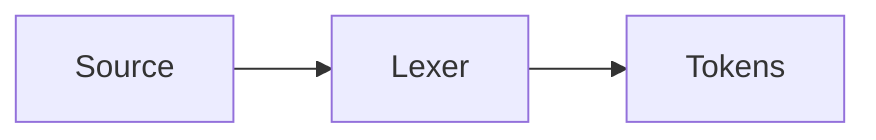
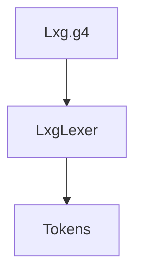

# 第3章 词法分析：把字符切成 Token

# 一、前言
词法分析把字符流切分为“最小有意义单元”Token，是编译器的第一道闸口。本章聚焦规则编写与可视化验证。

# 二、目标
- 了解 Token、跳过通道（skip）、关键字/标识符的区分
- 能通过命令观察 Token 序列并定位问题
- 会识别常见陷阱（转义、空白、注释）

# 三、设计
术语说明：
- Token：如 `ID/INT/STRING` 与字面量 `'let'/'print'`
- skip：`WS/COMMENT -> skip` 从 Token 流中丢弃

核心流程图：


架构交互图：


# 四、实现
目录树（关注项）：
```text
src
└── main
    └── antlr4
        └── com
            └── lxg
                └── antlr
                    └── Lxg.g4
```

命令：
```bash
java -jar target/my-language-0.1.0-SNAPSHOT.jar examples/arithmetic.lxg --dump-tokens
```

代码对照：语法-词法边界（节选）
```5:13:src/main/antlr4/com/lxg/antlr/Lxg.g4
stmt
    : 'print' expr ';'
    | 'let' ID '=' expr ';'
    | ID '=' expr ';'
    | 'if' '(' expr ')' block ('else' block)?
    | block
    ;

block: '{' stmt* '}';
```

代码对照：Token 与跳过规则
```36:42:src/main/antlr4/com/lxg/antlr/Lxg.g4
ID: [a-zA-Z_][a-zA-Z_0-9]*;
INT: [0-9]+;
STRING: '"' ( ~["\\] | '\\' . )* '"';
TRUE: 'true';
FALSE: 'false';
WS: [ \t\r\n]+ -> skip;
COMMENT: '//' ~[\r\n]* -> skip;
```

常见陷阱：
- 关键字被 `ID` 吞噬：需用字面量 `'let'` 明确规则
- 字符串转义遗漏：确保 `\\` 与 `\"` 等
- 忘记 `WS/COMMENT -> skip`：导致输出冗余

# 五、测试
- 手动：观察 Token 流是否与源码一致（标识符/字面量/分隔）

# 六、总结
- 词法规则决定 Token 的边界与类型，建议先以简单规则跑通，再增量完善
- dump-tokens 是定位早期问题的最快手段 