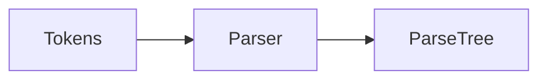
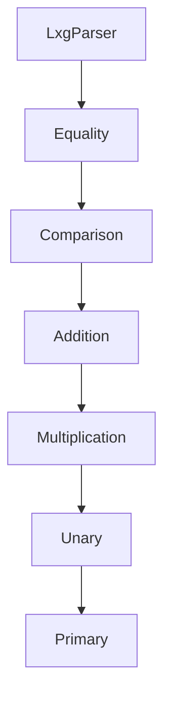

# 第4章 语法分析：把 Token 组装成结构

# 一、前言
语法分析把 Token 规约为结构化的 Parse Tree，并通过优先级与结合性确保表达式按预期解析。

# 二、目标
- 理解优先级与左结合的设计方式
- 能用 dump-parse-tree 观察解析结果
- 识别常见错误（运算符歧义、优先级错位）

# 三、设计
术语说明：
- 左结合：`a-b-c` 解析为 `(a-b)-c`
- 层级法：从低到高分层实现优先级

核心流程图：


架构交互图：


# 四、实现
目录树（关注项）：
```text
src
└── main
    ├── antlr4/com/lxg/antlr/Lxg.g4
    └── java/com/lxg/frontend/AstBuilder.java
```

命令：
```bash
java -jar target/my-language-0.1.0-SNAPSHOT.jar examples/arithmetic.lxg --dump-parse-tree | cat
```

优先级层次（自低到高）：
- `expr → equality → comparison → addition → multiplication → unary → primary`

代码对照：表达式层次与一元规则（节选）
```15:25:src/main/antlr4/com/lxg/antlr/Lxg.g4
expr: equality;

equality: comparison (( '==' | '!=' ) comparison)*;

comparison: addition (( '<' | '>' | '<=' | '>=' ) addition)*;

addition: multiplication (( '+' | '-' ) multiplication)*;

multiplication: unary (( '*' | '/' ) unary)*;

unary: ( '+' | '-' | '!' ) unary | primary;
```

代码对照：AstBuilder 中 addition 的左结合折叠
```134:147:src/main/java/com/lxg/frontend/AstBuilder.java
@Override
public Object visitAddition(LxgParser.AdditionContext ctx) {
    Object left = visit(ctx.multiplication(0));
    for (int i = 1; i < ctx.multiplication().size(); i++) {
        String opText = ctx.getChild(2 * i - 1).getText();
        Object right = visit(ctx.multiplication(i));
        BinaryOp op = "+".equals(opText) ? BinaryOp.ADD : BinaryOp.SUB;
        left = new BinaryExpr(pos(ctx.getStart()), (Expression) left, op, (Expression) right);
    }
    return left;
}
```

代码对照：AstBuilder 中 multiplication 的左结合折叠
```149:162:src/main/java/com/lxg/frontend/AstBuilder.java
@Override
public Object visitMultiplication(LxgParser.MultiplicationContext ctx) {
    Object left = visit(ctx.unary(0));
    for (int i = 1; i < ctx.unary().size(); i++) {
        String opText = ctx.getChild(2 * i - 1).getText();
        Object right = visit(ctx.unary(i));
        BinaryOp op = "*".equals(opText) ? BinaryOp.MUL : BinaryOp.DIV;
        left = new BinaryExpr(pos(ctx.getStart()), (Expression) left, op, (Expression) right);
    }
    return left;
}
```

# 五、测试
- 运行：`--dump-parse-tree` 验证树形结构与结合性

# 六、总结
- 通过层级与左结合可稳定解析表达式；调试优先级问题时，自底向上核对每一层 