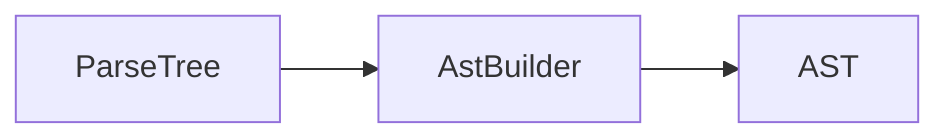
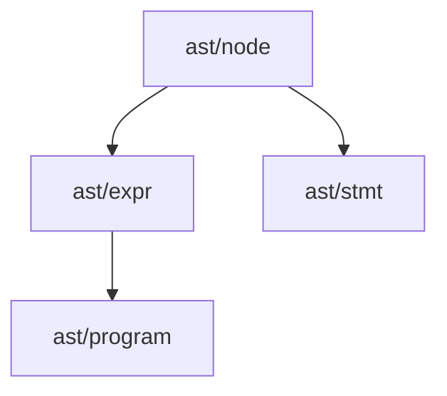

# 第5章 AST：抽象语法树的设计与构建

# 一、前言

AST 是对解析树的“语义化”抽象，去掉语法噪音，仅保留对后续阶段重要的结构。

# 二、目标

- 理解 AST 与 Parse Tree 的差异
- 掌握左结合折叠、位置信息收集
- 能用 dump-ast 观察抽象结构

# 三、设计

术语说明：

- SourcePos：源位置 `line:column`
- 左结合折叠：链式二元运算按左结合构造嵌套 `BinaryExpr`

核心流程图：



架构交互图：



# 四、实现

目录树（关注项）：

```text
src/main/java/com/lxg/ast/node
src/main/java/com/lxg/ast/expr
src/main/java/com/lxg/ast/stmt
src/main/java/com/lxg/ast/program
src/main/java/com/lxg/frontend/AstBuilder.java
```

命令：

```bash
java -jar target/my-language-0.1.0-SNAPSHOT.jar examples/conditions.lxg --dump-ast
```

代码对照：左结合的 addition 折叠

```134:147:src/main/java/com/lxg/frontend/AstBuilder.java
/** addition：处理 + -，按左结合折叠为 BinaryExpr。 */
@Override
public Object visitAddition(LxgParser.AdditionContext ctx) {
    Object left = visit(ctx.multiplication(0));
    for (int i = 1; i < ctx.multiplication().size(); i++) {
        String opText = ctx.getChild(2 * i - 1).getText();
        Object right = visit(ctx.multiplication(i));
        BinaryOp op = "+".equals(opText) ? BinaryOp.ADD : BinaryOp.SUB;
        left = new BinaryExpr(pos(ctx.getStart()), (Expression) left, op, (Expression) right);
    }
    return left;
}
```

代码对照：primary 中的字符串反转义（完整实现）

```204:227:src/main/java/com/lxg/frontend/AstBuilder.java
/**
 * 反转义字符串字面量：将转义序列替换为实际字符。
 * 支持：\n 换行、\r 回车、\t 制表、\" 双引号、\\ 反斜杠。
 */
private static String unescapeString(String s) {
    StringBuilder sb = new StringBuilder();
    for (int i = 0; i < s.length(); i++) {
        char c = s.charAt(i);
        if (c == '\\' && i + 1 < s.length()) {
            char n = s.charAt(++i);
            switch (n) {
                case 'n': sb.append('\n'); break;
                case 'r': sb.append('\r'); break;
                case 't': sb.append('\t'); break;
                case '"': sb.append('"'); break;
                case '\\': sb.append('\\'); break;
                default: sb.append(n); break;
            }
        } else {
            sb.append(c);
        }
    }
    return sb.toString();
}
```

# 五、测试

- 运行：`mvn -q -Dtest=AstPrinterTest test`
- 检查点：`Let/If/Print` 等关键结构是否打印

# 六、总结

- AST 是“语义友好”的中间形态，建立起后续语义与生成的桥梁；保证 `SourcePos` 全链路传递 