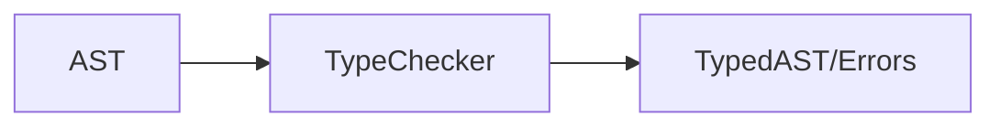
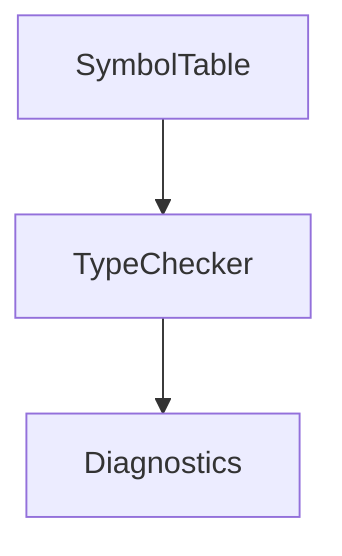

# 第6章 语义分析：类型、符号与错误

# 一、前言

语义分析确保“能跑且合理”，包含声明/使用检查、类型匹配与诊断输出。

# 二、目标

- 明确最小规则：声明先行、类型一致、条件为布尔
- 学会读懂带位置的诊断并能快速定位
- 与生成前置耦合，保证后续阶段安全

# 三、设计

术语说明：

- 符号表：变量名 → (类型, 槽位)
- 诊断：统一收集并输出错误信息

核心流程图：



架构交互图：



# 四、实现

目录树（关注项）：

```text
src/main/java/com/lxg/sema/SymbolTable.java
src/main/java/com/lxg/sema/TypeChecker.java
src/main/java/com/lxg/sema/Diagnostics.java
```

代码对照：符号表声明与解析

```28:45:src/main/java/com/lxg/sema/SymbolTable.java
public Local declare(String name, ValueType type) { ... }
public Local resolve(String name) { ... }
```

代码对照：类型推断与赋值检查

```94:139:src/main/java/com/lxg/sema/TypeChecker.java
private ValueType infer(Expression e, SymbolTable symbols, Diagnostics diags) { ... }
```

代码对照：checkStatement 中的赋值分支（完整）

```60:73:src/main/java/com/lxg/sema/TypeChecker.java
} else if (s instanceof AssignStmt) {
    AssignStmt as = (AssignStmt) s;
    Local local;
    try {
        local = symbols.resolve(as.name);
    } catch (IllegalStateException e) {
        diags.error(e.getMessage() + at(as));
        return;
    }
    ValueType rt = infer(as.value, symbols, diags);
    if (local.type != rt) {
        diags.error("Type mismatch for variable '" + as.name + "': expected " + local.type + ", got " + rt + at(as));
    }
} else if (s instanceof PrintStmt) {
```

命令：

```bash
java -jar target/my-language-0.1.0-SNAPSHOT.jar examples/error_undeclared.lxg
java -jar target/my-language-0.1.0-SNAPSHOT.jar examples/error_type_mismatch.lxg
```

# 五、测试

- 运行：`mvn -q -Dtest=SemanticErrorTest test`
- 检查点：包含“Unknown variable”与“Type mismatch”等关键字串

# 六、总结

- 语义层是“安全闸门”，尽可能把错误拦在生成之前；位置来源自 `SourcePos`，便于用户修复 