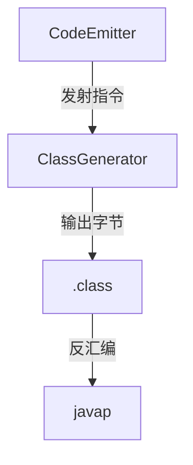

# 第7章 字节码生成：让 AST 变成 JVM 指令

# 一、前言
本章把 AST 翻译为 JVM 字节码（.class），并通过反汇编对照验证结果。我们用“栈机器”的直觉理解指令序列：压栈、运算、跳转、打印。

# 二、目标
- 理解 JVM 栈模型与常见指令映射（IADD/IFEQ/INVOKEVIRTUAL 等）
- 能通过 `--emit-class + javap -v` 验证生成结果
- 掌握 println 重载选择、比较归一化为 0/1 的实现套路

# 三、设计
术语说明：
- 描述符（Descriptor）：如 `(I)V`、`([Ljava/lang/String;)V`
- Label：跳转锚点，用于 if/else、循环

核心流程图：


架构交互图：


# 四、实现
目录树（关注项）：
```text
src/main/java/com/lxg/codegen/CodeEmitter.java
src/main/java/com/lxg/codegen/ClassGenerator.java
```

命令：
```bash
java -jar target/my-language-0.1.0-SNAPSHOT.jar examples/arithmetic.lxg --emit-class=out/Program.class
javap -v out/Program.class | sed -n '1,200p'
```

代码对照：println 重载选择
```74:86:src/main/java/com/lxg/codegen/CodeEmitter.java
private void emitPrint(PrintStmt ps) {
    mv.visitFieldInsn(GETSTATIC, "java/lang/System", "out", "Ljava/io/PrintStream;");
    ValueType type = emitExpression(ps.expression);
    if (type == ValueType.INT) {
        mv.visitMethodInsn(INVOKEVIRTUAL, "java/io/PrintStream", "println", "(I)V", false);
    } else if (type == ValueType.STRING) {
        mv.visitMethodInsn(INVOKEVIRTUAL, "java/io/PrintStream", "println", "(Ljava/lang/String;)V", false);
    } else if (type == ValueType.BOOLEAN) {
        mv.visitMethodInsn(INVOKEVIRTUAL, "java/io/PrintStream", "println", "(Z)V", false);
    } else {
        throw new IllegalStateException("Unsupported type in print: " + type);
    }
}
```

代码对照：一元逻辑非 `!` 的生成
```178:201:src/main/java/com/lxg/codegen/CodeEmitter.java
private ValueType emitUnary(UnaryExpr ue) { ... }
```

代码对照：相等/比较生成 0/1 的布尔值
```229:257:src/main/java/com/lxg/codegen/CodeEmitter.java
case EQ: ... case GE: { ... }
```

代码对照：常量入栈的“最短指令”选择
```263:284:src/main/java/com/lxg/codegen/CodeEmitter.java
private void pushInt(int v) { ... }
```

代码对照：生成 main 与默认构造
```23:53:src/main/java/com/lxg/codegen/ClassGenerator.java
public byte[] generate(CompilationUnit unit) { ... }
```

代码对照：分支模板（完整 emitIf）
```53:68:src/main/java/com/lxg/codegen/CodeEmitter.java
private void emitIf(IfStmt ifs) {
    ValueType condType = emitExpression(ifs.condition);
    if (condType != ValueType.BOOLEAN) {
        throw new IllegalStateException("if condition must be boolean");
    }
    Label elseLabel = new Label();
    Label endLabel = new Label();
    mv.visitJumpInsn(IFEQ, elseLabel);
    for (Statement s : ifs.thenBlock.statements) emitStatement(s);
    mv.visitJumpInsn(GOTO, endLabel);
    mv.visitLabel(elseLabel);
    if (ifs.elseBlock != null) {
        for (Statement s : ifs.elseBlock.statements) emitStatement(s);
    }
    mv.visitLabel(endLabel);
}
```

# 五、测试
- 手动：对 `examples/arithmetic.lxg` 反汇编，核对 `println`、算术与比较序列
- 建议新增：带 `true/false`、字符串与整型混合打印的 E2E 用例

# 六、总结
- 生成套路：压栈→运算/跳转→归一化→打印；配合 `javap -v` 精准定位生成问题
- `COMPUTE_FRAMES|COMPUTE_MAXS` 简化了栈深与帧的管理 