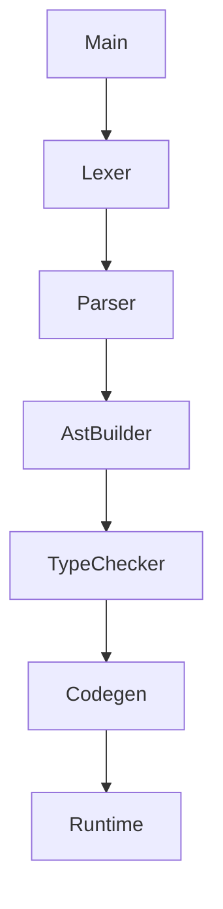

# 第9章 CLI 与调试开关的正确打开方式

# 一、前言
高效的排障从“看得见的中间态”开始。本章统一 CLI 参数的使用顺序与组合，形成自底向上的验证路径。

# 二、目标
- 熟练使用 `--dump-tokens/--dump-parse-tree/--dump-ast/--emit-class`
- 能读懂 CLI 的参数解析代码与主流程代码
- 按推荐顺序定位问题来源

# 三、设计
术语说明：
- dump：打印中间产物
- emit-class：导出 .class 供 `javap -v` 反汇编

核心流程图：


架构交互图：


# 四、实现
目录树（关注项）：
```text
src
└── main
    └── java
        └── com
            └── lxg
                └── tools
                    └── Main.java
```

命令：
```bash
java -jar target/my-language-0.1.0-SNAPSHOT.jar examples/arithmetic.lxg --dump-tokens
java -jar target/my-language-0.1.0-SNAPSHOT.jar examples/arithmetic.lxg --dump-parse-tree | cat
java -jar target/my-language-0.1.0-SNAPSHOT.jar examples/arithmetic.lxg --dump-ast
java -jar target/my-language-0.1.0-SNAPSHOT.jar examples/arithmetic.lxg --emit-class=out/Program.class
javap -v out/Program.class | sed -n '1,200p'
```

代码对照：参数解析
```47:60:src/main/java/com/lxg/tools/Main.java
for (String arg : args) {
    if (arg.startsWith("--emit-class=")) {
        emitClassPath = arg.substring("--emit-class=".length());
    } else if ("--dump-tokens".equals(arg)) {
        dumpTokens = true;
    } else if ("--dump-parse-tree".equals(arg)) {
        dumpParseTree = true;
    } else if ("--dump-ast".equals(arg)) {
        dumpAst = true;
    } else if (!arg.startsWith("--")) {
        sourcePath = arg;
    }
}
```

代码对照：完整流水线（runSource 节选）
```77:121:src/main/java/com/lxg/tools/Main.java
public static void runSource(String source, String emitClassPath, boolean dumpTokens, boolean dumpParseTree, boolean dumpAst) {
    try {
        // 1) Lexer/Parser
        LxgLexer lexer = new LxgLexer(CharStreams.fromString(source));
        CommonTokenStream tokens = new CommonTokenStream(lexer);
        if (dumpTokens) {
            tokens.fill();
            for (Token t : tokens.getTokens()) {
                System.out.println(t.getText() + " -> " + LxgLexer.VOCABULARY.getDisplayName(t.getType()));
            }
        }
        LxgParser parser = new LxgParser(tokens);
        LxgParser.ProgContext prog = parser.prog();
        if (dumpParseTree) {
            System.out.println(prog.toStringTree(parser));
        }
        // 2) AST
        AstBuilder builder = new AstBuilder();
        CompilationUnit unit = builder.build(prog);
        if (dumpAst) {
            System.out.println(AstPrinter.print(unit));
        }
        // 3) Semantic check
        Diagnostics diags = new TypeChecker().check(unit);
        if (diags.hasErrors()) {
            diags.printAll(System.err);
            return; // 中止
        }
        // 4) Codegen
        ClassGenerator gen = new ClassGenerator();
        byte[] cls = gen.generate(unit);
        // 5) 可选：写出 .class
        if (emitClassPath != null && !emitClassPath.isEmpty()) {
            Path out = Paths.get(emitClassPath);
            Files.createDirectories(out.getParent() == null ? Paths.get(".") : out.getParent());
            Files.write(out, cls);
            System.out.println("Emitted class to: " + out.toAbsolutePath());
        }
        // 6) 运行
        new LxgShell().run(cls);
    } catch (Exception e) {
        e.printStackTrace(System.err);
        throw new RuntimeException("Failed to run source", e);
    }
}
```

# 五、测试
- 端到端：`LxgEndToEndTest`
- 手动：对同一源码逐层 dump 并记录差异，验证链路正确性

# 六、总结
- 推荐顺序：tokens → parse-tree → ast → emit-class；自底向上缩小范围
- CLI 是“可观测性入口”，与生成、反汇编配合更高效 