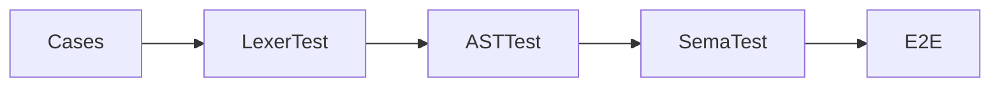
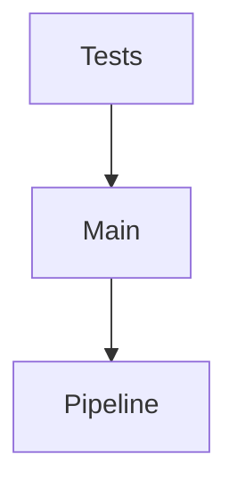

# 第10章 用测试拆层理解编译流程

# 一、前言

测试是理解与防回归的“放大镜”。通过分层测试，我们能快速定位问题处于哪一层。

# 二、目标

- 建立分层测试视角：词法/AST/语义/端到端
- 掌握标准输出捕获与诊断断言写法
- 能按需单独运行任一测试类

# 三、设计

核心流程图：



架构交互图：



# 四、实现

目录树（关注项）：

```text
src
└── test
    └── java
        └── com
            └── lxg
                ├── SemanticErrorTest.java
                └── LxgEndToEndTest.java
```

命令：

```bash
mvn -q test
mvn -q -Dtest=LxgEndToEndTest test
```

代码对照：捕获标准输出（节选）

```25:35:src/test/java/com/lxg/LxgEndToEndTest.java
private String run(String source) {
    PrintStream oldOut = System.out;
    ByteArrayOutputStream bout = new ByteArrayOutputStream();
    System.setOut(new PrintStream(bout));
    try {
        Main.runSource(source, null, false, false, false);
        return new String(bout.toByteArray());
    } finally {
        System.setOut(oldOut);
    }
}
```

代码对照：诊断断言（未声明变量）

```28:39:src/test/java/com/lxg/SemanticErrorTest.java
@Test
public void undeclared_variable() {
    String src = "print x;";
    LxgLexer lexer = new LxgLexer(CharStreams.fromString(src));
    CommonTokenStream tokens = new CommonTokenStream(lexer);
    LxgParser parser = new LxgParser(tokens);
    CompilationUnit unit = new AstBuilder().build(parser.prog());
    Diagnostics diags = new TypeChecker().check(unit);
    assertTrue(diags.hasErrors());
    assertTrue(diags.getErrors().stream().anyMatch(e -> e.contains("Unknown variable")));
}
```

# 五、测试

- 运行：`mvn -q test`
- 常见排错：
    - 输出不一致：注意换行 `\n` 与顺序
    - 诊断为空：确认未跳过语义层或样例无错

# 六、总结

- 测试拆层能显著提升定位效率；端到端测试保证主线用法稳定 