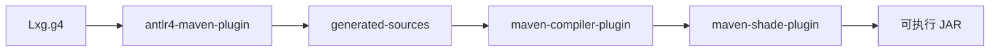
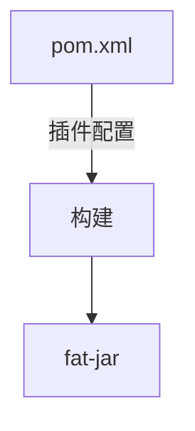

# 第11章 构建与生成：Maven 管道与插件

# 一、前言

构建把源码、生成代码与依赖打包为可运行产物。本章梳理 ANTLR 生成、编译与打包流程。

# 二、目标

- 了解 antlr4 插件与 shade 打包的职责
- 知道生成代码位置与主类配置
- 会用命令完成构建与运行

# 三、设计

核心流程图：



架构交互图：



# 四、实现

目录树（关注项）：

```text
pom.xml
```

命令：

```bash
mvn -q -DskipTests clean package
java -jar target/my-language-0.1.0-SNAPSHOT.jar examples/hello.lxg
```

代码对照：ANTLR 插件（摘录）

```41:58:pom.xml
<plugin>
  <groupId>org.antlr</groupId>
  <artifactId>antlr4-maven-plugin</artifactId>
  <version>${antlr4.version}</version>
  <executions> ... </executions>
</plugin>
```

代码对照：Shade 打包（摘录）

```68:85:pom.xml
<plugin>
  <groupId>org.apache.maven.plugins</groupId>
  <artifactId>maven-shade-plugin</artifactId>
  <version>3.5.2</version>
  <executions> ... <mainClass>com.lxg.tools.Main</mainClass> ... </executions>
</plugin>
```

# 五、测试

- 运行：`mvn -q -DskipTests clean package` 后，执行示例源文件
- 排错：若提示找不到主类，核对 shade `mainClass` 设置是否为 `com.lxg.tools.Main`

# 六、总结

- 构建链路：ANTLR 生成 → 编译 → 打包；确认生成目录与入口主类配置即可 