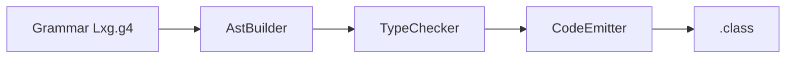
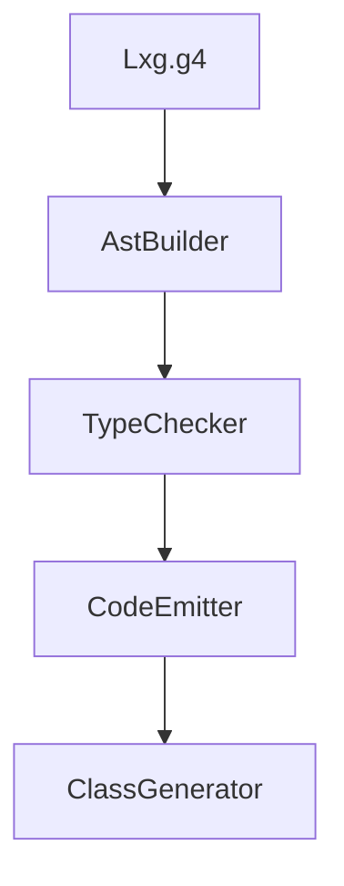

# 第12章 一步步扩展语言能力

# 一、前言

当主线打通后，就可以安全地给语言加“新能力”。扩展的正确姿势是：从文法开始，贯穿 AST/语义/生成，一次走通一条链路。

# 二、目标

- 能在 `multiplication` 层加入 `%`（取模），贯通至字节码 `IREM`
- 会基于 `if` 的跳转套路实现 `while (cond) { ... }`
- 明确扩展点与改动位置（g4/AST/TypeChecker/CodeEmitter）

# 三、设计

术语说明：

- 兼容性扩展：在不破坏现有语义的前提下加入新语法/语义/生成
- Label 跳转：循环与分支的控制流“锚点”

核心流程图（扩展路径）：



架构交互图（改动范围）：



# 四、实现

目录树（关注项）：

```text
src/main/antlr4/com/lxg/antlr/Lxg.g4
src/main/java/com/lxg/frontend/AstBuilder.java
src/main/java/com/lxg/sema/TypeChecker.java
src/main/java/com/lxg/codegen/CodeEmitter.java
```

命令（修改后重建）：

```bash
mvn -q -DskipTests clean package
# 运行/反汇编修改后的样例
java -jar target/my-language-0.1.0-SNAPSHOT.jar examples/arithmetic.lxg --emit-class=out/Program.class
javap -v out/Program.class | sed -n '1,200p'
```

代码对照：在 `multiplication` 层加入 `%`（现状节选）

```23:25:src/main/antlr4/com/lxg/antlr/Lxg.g4
multiplication: unary (( '*' | '/' ) unary)*;

unary: ( '+' | '-' | '!' ) unary | primary;
```

> 修改思路：把 `'*' | '/'` 扩为 `'*' | '/' | '%'`，并在 AST/生成中识别 `MOD`

代码对照：算术发射分支（为 `%` 增加 IREM）

```212:228:src/main/java/com/lxg/codegen/CodeEmitter.java
case ADD: case SUB: case MUL: case DIV: {
    ValueType lt = emitExpression(be.left);
    ValueType rt = emitExpression(be.right);
    if (lt != ValueType.INT || rt != ValueType.INT) { ... }
    switch (be.op) {
        case ADD: mv.visitInsn(IADD); break;
        case SUB: mv.visitInsn(ISUB); break;
        case MUL: mv.visitInsn(IMUL); break;
        case DIV: mv.visitInsn(IDIV); break;
    }
    return ValueType.INT;
}
```

> 修改思路：为 `MOD` 增加 `case` 并发射 `IREM`

代码对照：`while` 可借鉴的控制流模板（以 if 为例）

```53:68:src/main/java/com/lxg/codegen/CodeEmitter.java
private void emitIf(IfStmt ifs) {
    ValueType condType = emitExpression(ifs.condition);
    Label elseLabel = new Label(); Label endLabel = new Label();
    mv.visitJumpInsn(IFEQ, elseLabel);
    for (Statement s : ifs.thenBlock.statements) emitStatement(s);
    mv.visitJumpInsn(GOTO, endLabel);
    mv.visitLabel(elseLabel);
    if (ifs.elseBlock != null) { ... }
    mv.visitLabel(endLabel);
}
```

> `while` 模板：`start:` 求 cond → `IFEQ end` → body → `GOTO start` → `end:`

# 五、测试

- 新增/修改样例：`x = 10 % 3` 的打印；手动循环 `while (i < n)` 打印序列
- 运行：重建后执行与反汇编，核对 `IREM` 与跳转标签序列

# 六、总结

- 扩展路径始终是“g4 → AST → Sema → Codegen → 运行”；每一步都要有可视或可验证产物
- 循环与分支共享同类跳转套路；算术扩展注意静态类型与指令选择的一致性 