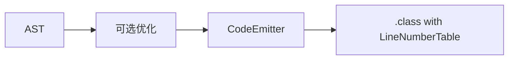
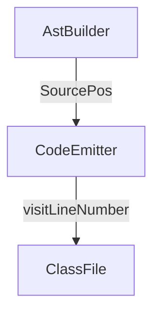

# 第13章 优化与可调试性

# 一、前言
在行为正确的前提下，我们可以添加“看得更清、跑得更顺”的能力：简单优化与调试信息（行号表）。

# 二、目标
- 了解常量折叠/死代码消除/短路求值的入门实现思路
- 在生成中添加 `visitLineNumber`，用 `javap -v` 观察行号
- 保持现有测试通过，验证优化不改语义

# 三、设计
核心流程图：


架构交互图：


# 四、实现
目录树（关注项）：
```text
src/main/java/com/lxg/codegen/CodeEmitter.java
src/main/java/com/lxg/frontend/AstBuilder.java
```

代码对照：常量折叠切入点（算术分支）
```212:228:src/main/java/com/lxg/codegen/CodeEmitter.java
case ADD:
case SUB:
case MUL:
case DIV: {
    ValueType lt = emitExpression(be.left);
    ValueType rt = emitExpression(be.right);
    if (lt != ValueType.INT || rt != ValueType.INT) {
        throw new IllegalStateException("Arithmetic expects INT operands");
    }
    switch (be.op) {
        case ADD: mv.visitInsn(IADD); break;
        case SUB: mv.visitInsn(ISUB); break;
        case MUL: mv.visitInsn(IMUL); break;
        case DIV: mv.visitInsn(IDIV); break;
    }
    return ValueType.INT;
}
```
说明：在发射前可判断 `be.left` 与 `be.right` 是否为 `IntLiteral`，直接在编译期计算常量值并 `pushInt`，省去运行时运算。

代码对照：SourcePos 传递（便于行号表映射）
```25:39:src/main/java/com/lxg/frontend/AstBuilder.java
private static SourcePos pos(org.antlr.v4.runtime.Token t) {
    if (t == null) return null;
    return new SourcePos(t.getLine(), t.getCharPositionInLine());
}

public CompilationUnit build(LxgParser.ProgContext ctx) {
    List<Statement> statements = new ArrayList<>();
    for (LxgParser.StmtContext sc : ctx.stmt()) {
        statements.add((Statement) visit(sc));
    }
    return new CompilationUnit(pos(ctx.getStart()), statements);
}
```
说明：在语句发射前可基于 `stmt.getPos().line` 打 `Label` 并调用 `visitLineNumber`，实现源行到字节码的映射。

命令：
```bash
# 反汇编观察行号
java -jar target/my-language-0.1.0-SNAPSHOT.jar examples/arithmetic.lxg --emit-class=out/Program.class
javap -v out/Program.class | sed -n '1,200p'
```

# 五、测试
- 回归：运行现有测试确保输出不变
- 视觉验证：`javap -v` 输出包含 `LineNumberTable`，行号与源一致

# 六、总结
- 优化与可调试性应“先不破，再改良”，所有改动以测试与可视化为准绳；行号表是提升可定位性的利器 