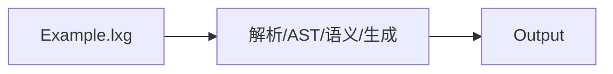
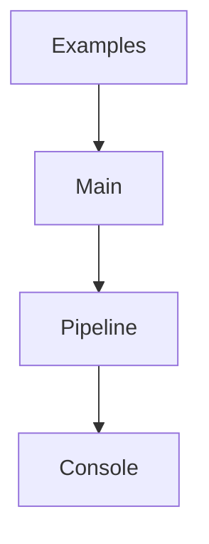

# 第14章 案例与练习

# 一、前言

综合上一章的知识，用完整的案例串联语言能力，并通过练习巩固扩展思路。

# 二、目标

- 能组合算术、比较、分支与打印完成任务
- 会修改示例并使用调试开关观察变化
- 能据此设计自己的小练习并验证

# 三、设计

核心流程图：



架构交互图：



# 四、实现

目录树（关注项）：

```text
examples/hello.lxg
examples/arithmetic.lxg
examples/conditions.lxg
examples/error_undeclared.lxg
examples/error_type_mismatch.lxg
```

命令：

```bash
# 运行案例
java -jar target/my-language-0.1.0-SNAPSHOT.jar examples/arithmetic.lxg
java -jar target/my-language-0.1.0-SNAPSHOT.jar examples/conditions.lxg
# 调试开关
java -jar target/my-language-0.1.0-SNAPSHOT.jar examples/conditions.lxg --dump-ast
```

代码对照：算术样例

```1:7:examples/arithmetic.lxg
let a = 10;
let b = 3;
print a + b;
print a - b;
print a * b;
print a / b;
print (a + b) * (a - b);
```

代码对照：条件样例

```1:4:examples/conditions.lxg
let a = 5;
let b = 10;
if (a < b) { print "a<b"; } else { print "no"; }
if (a == 5) { print true; } else { print false; }
```

# 五、测试

- 端到端：新增/调整用例，输出应与手算一致
- 语义：错误样例应产生带位置的诊断信息

# 六、总结

- 案例是“知识归一”的最好方式；建议先改小处（字面量/顺序），再到结构（分支/循环），最后到语义与生成扩展 